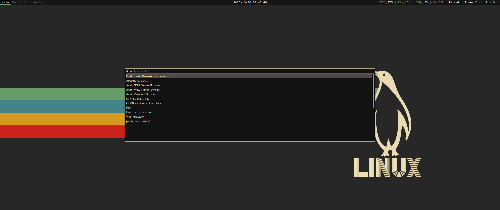

# My OLD personal dotfiles
Bspwm configuration

## Dependencies
+ `bspwm`     - Window Manager
+ `sxhkd`     - Hotkey Daemon
+ `polybar`   - Top Bar
+ `alacritty` - Terminal Emulator
+ `picom`     - Compositor
+ `tmux`      - Terminal Multiplexer
+ `rofi`      - Windows/App Menu

## Screenshots

